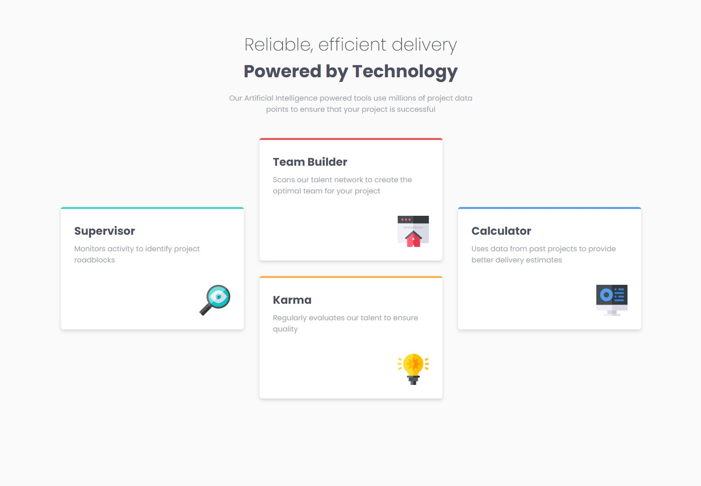
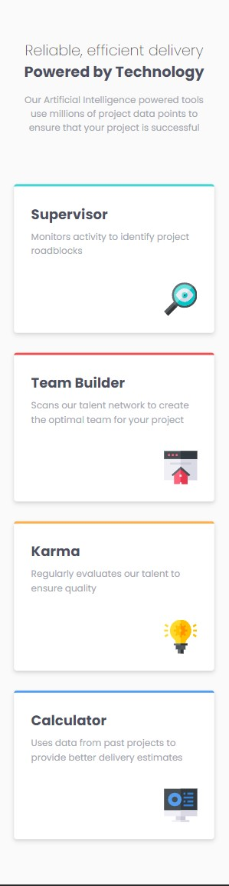
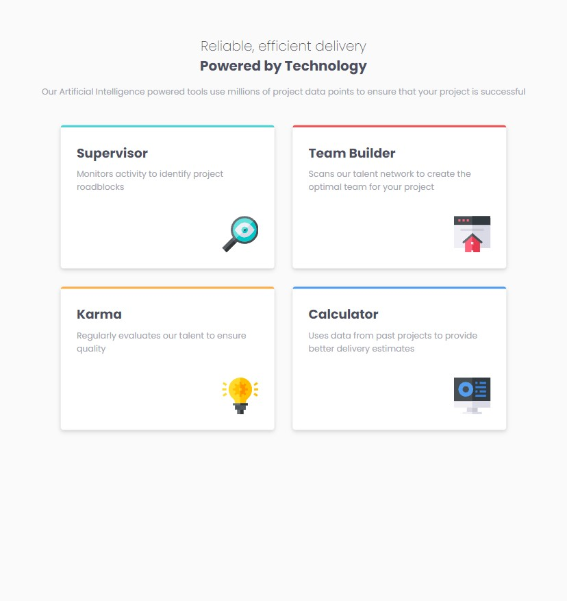

# Four card feature section solution

This is a solution to the [Four card feature section challenge on Frontend Mentor](https://www.frontendmentor.io/challenges/four-card-feature-section-weK1eFYK).

## Table of contents

- [Overview](#overview)
  - [The challenge](#the-challenge)
  - [Screenshot](#screenshot)
  - [Links](#links)
- [My process](#my-process)
  - [Built with](#built-with)
  - [What I learned](#what-i-learned)
  - [Useful resources](#useful-resources)
- [Author](#author)

## Overview

### The challenge

Create cards feature selection UI based on the screenshots provided in the design file. Try to make it in design as similar as possible to the original one.

Users should be able to:

- View the optimal layout for the site depending on their device's screen size

### Screenshot

#### Desktop

#### Mobile

#### Tablet

### Links

- Solution URL: [Code](https://github.com/hellcsaba/four-card)
- Live Site URL: [Four card feature selection live](https://hellcsaba.github.io/four-card/)

## My process

### Built with

- Semantic HTML5 markup
- CSS custom properties
- Flexbox
- CSS Grid
- Mobile-first workflow
- BEM notation
- CSS transitions

### What I learned

During this project I learnt how to leverage CSS grid properties. Additionally, I implemented the layout for mobile, tablet and desktop view as well. I added transitions to the cards for when they are hovered.

### Useful resources

- [Flexbox Froggy](https://flexboxfroggy.com/) - This helped me for get a hands-on and fast overview of flexbox properties.
- [CSS Grid Garden](https://cssgridgarden.com/#en) - This is an amazing website which helped me to understand CSS grid properties in an easy and effective way.

## Author

- Website - [Csaba Hell](https://github.com/hellcsaba)
- Frontend Mentor - [@hellcsaba](https://www.frontendmentor.io/profile/hellcsaba)
- LinkedIn - [@csabahell](https://www.linkedin.com/in/csabahell/)
